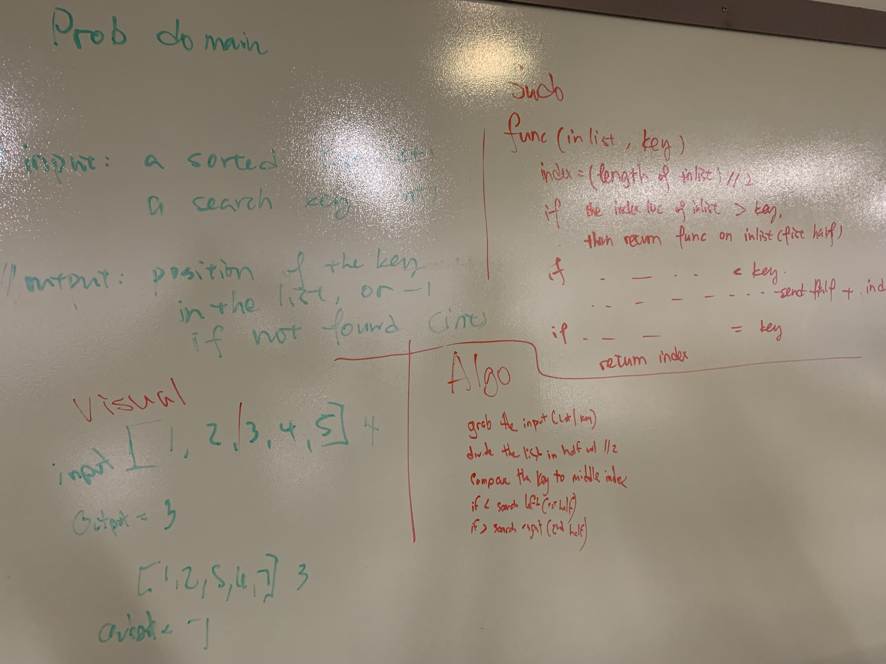

# Code Challenge 03 - Array Binary Search

## Feature Tasks

Write a function called BinarySearch which takes in 2 parameters: a sorted array and the search key. Without utilizing any of the built-in methods available to your language, return the index of the array’s element that is equal to the search key, or -1 if the element does not exist.

## Examples

####
    Input                  Args     Output
     [4,8,15,16,23,42]      15        2

    Input                   Args   Output
    [11,22,33,44,55,66,77]   90      -1

# Testing

To get started, start up your virtual environment (type "pipenv shell" in your terminal), then make sure that you have pytest installed ("pipenv install pytest"). To run the tests simply type "pytest" in your environment.

# Solution

***Author: [Daniel Frey](https://github.com/fncreative)
