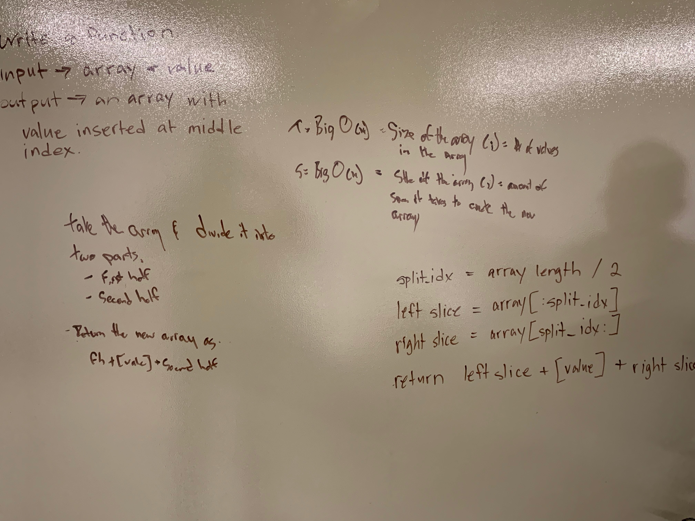

# Code Challenge 02

# Feature Tasks

Write a function called insertShiftArray which takes in an array and the value to be added. Without utilizing any of the built-in methods available to your language, return an array with the new value added at the middle index.

# Testing

To get started, start up your virtual environment (type "pipenv shell" in your terminal), then make sure that you have pytest installed ("pipenv install pytest"). To run the tests simply type "pytest" in your environment.

# Whiteboard

***Author: [Daniel Frey](https://github.com/fncreative)
