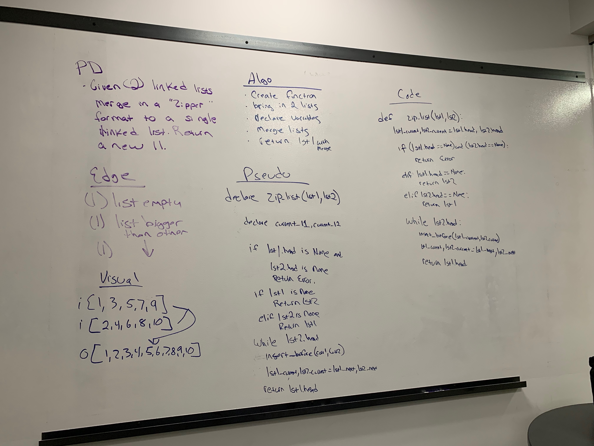

# Code Challenge 08 Linked List Merge


# Feature Tasks

Write a function called ```mergeLists``` which takes two linked lists as arguments. Zip the two linked lists together into one so that the nodes alternate between the two lists and return a reference to the head of the zipped list. Try and keep additional space down to O(1). You have access to the Node class and all the properties on the Linked List class as well as the methods created in previous challenges.

# Testing

To get started, start up your virtual environment (type "pipenv shell" in your terminal), then make sure that you have pytest installed ("pipenv install pytest"). To run the tests simply type "pytest" in your environment.

# Whiteboard



***Author: [Daniel Frey](https://github.com/fncreative)
